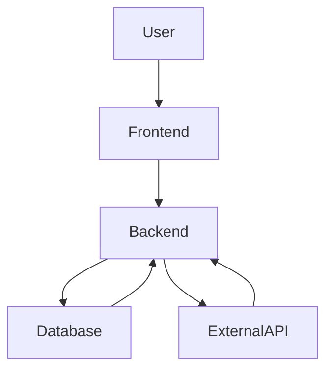
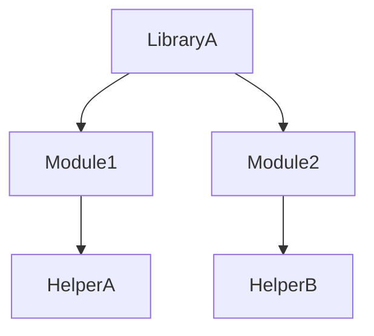
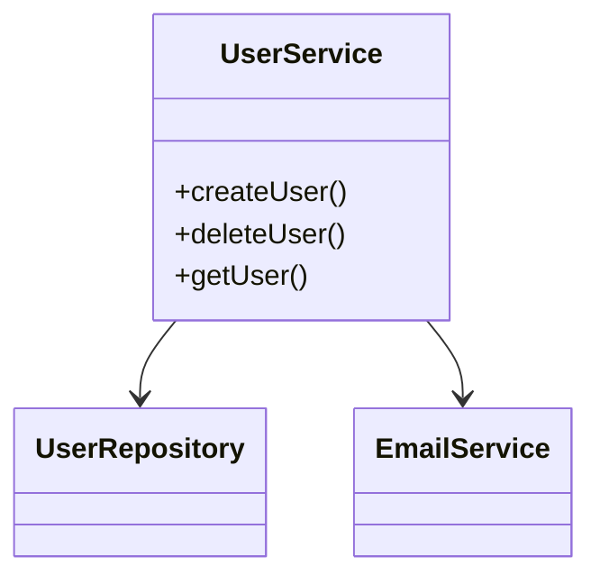
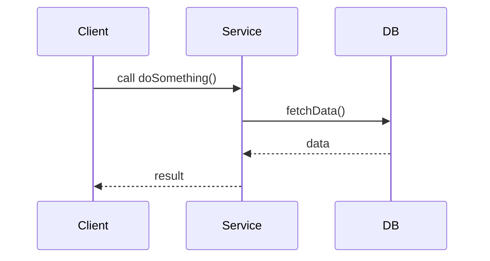
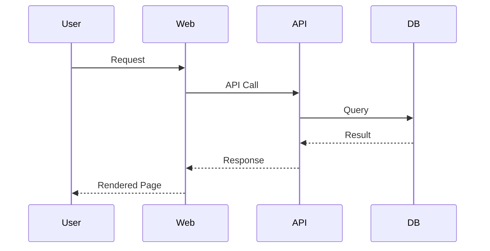

# Code Research Commands Cheat Sheet

| Command                                      | Description                                      |
|----------------------------------------------|--------------------------------------------------|
| /copySolution <destination_folder>           | Copy full solution to another companion folder    |
| /removeGitTracking <solution_folder>         | Remove git tracking from a copied solution folder |

## Generating Command Line Explanation of Existing Code
| Command                        | Description                        |
|--------------------------------|------------------------------------|
| /explainSolution               | Explain the full solution          |
| /explainProject                | Explain the project                |
| /explainClass <class_name>     | Explain the specified class        |
| /explainFunction <function_name> | Explain the specified function   |
| /explainVariable <variable_name> | Explain the specified variable   |

## Generating Command Line Comments for Existing Code (for code not accessible to git)
| Command                          | Description                                      |
|----------------------------------|--------------------------------------------------|
| /commentSolution                 | Add a personal comment to the full solution      |
| /commentProject                  | Add a personal comment to the project            |
| /commentClass <class_name>       | Add a personal comment to the specified class    |
| /commentFunction <function_name> | Add a personal comment to the specified function |
| /commentVariable <variable_name> | Add a personal comment to the specified variable |

---

## Generating Mermaid Diagrams for Code Analysis

You can use Copilot to generate Mermaid diagrams at different levels of your codebase.  
Below are example **commands** (prompts) and **text responses** for each level:

---

### Application Level

**Command:**  
`/generateMermaidDiagram application`

**Text Response:**  
_Copilot will output a high-level flowchart or sequence diagram showing the main components and their interactions._

---

### Library Level

**Command:**  
`/generateMermaidDiagram library <library_name>`

**Text Response:**  
_Copilot will show the main modules/classes and their relationships within the library._

---

### Class Level

**Command:**  
`/generateMermaidDiagram class <class_name>`

**Text Response:**  
_Copilot will show the class, its methods, and relationships to other classes._

---

### Function Level

**Command:**  
`/generateMermaidDiagram function <function_name>`

**Text Response:**  
_Copilot will show a sequence diagram or flowchart for the function logic._

---

### Sample Sequence Diagram Image

Below is a sample sequence diagram image (from the referenced blog) and the corresponding Mermaid markup:

**Image Example:**  

**Mermaid Markup Example:**

---

**Tip:**  
Be specific in your command for more accurate diagrams.  
Copy the Mermaid code into a Markdown file or Mermaid-compatible viewer to visualize.

---

