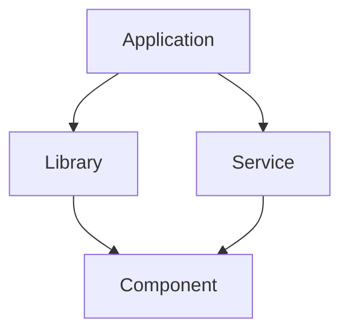
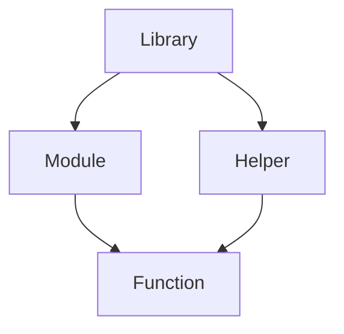
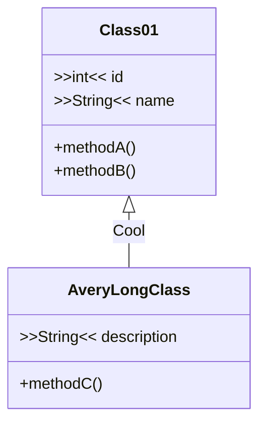
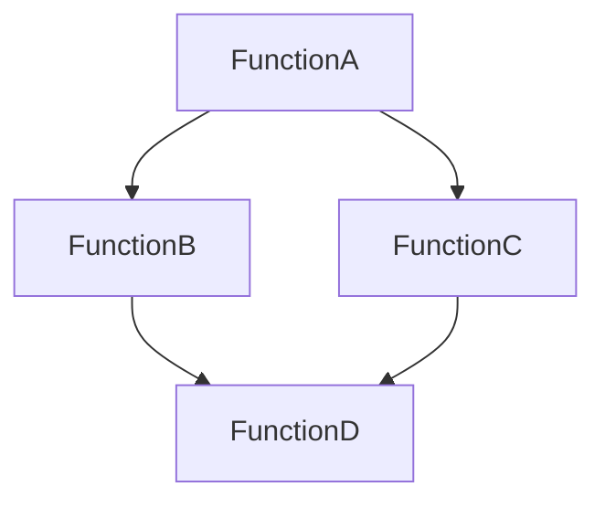

# Mermaid Diagram Examples
<!-- Mermaid documentation: https://mermaid.js.org/intro/ -->

## Application Level Diagram

## Library Level Diagram

## Class Level Diagram

## Function Level Diagram

---

For more complex diagrams and additional examples, please refer to the [Mermaid Live Editor](https://mermaid-js.github.io/mermaid-live-editor/) where you can experiment with Mermaid syntax and see live previews of your diagrams.

Also, check the [Mermaid Documentation](https://mermaid-js.github.io/mermaid/#/) for a comprehensive guide on using Mermaid, including all available diagram types, syntax details, and configuration options.