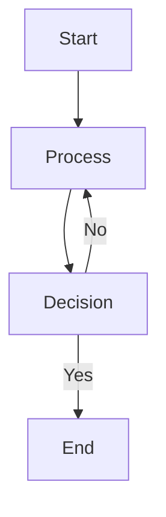
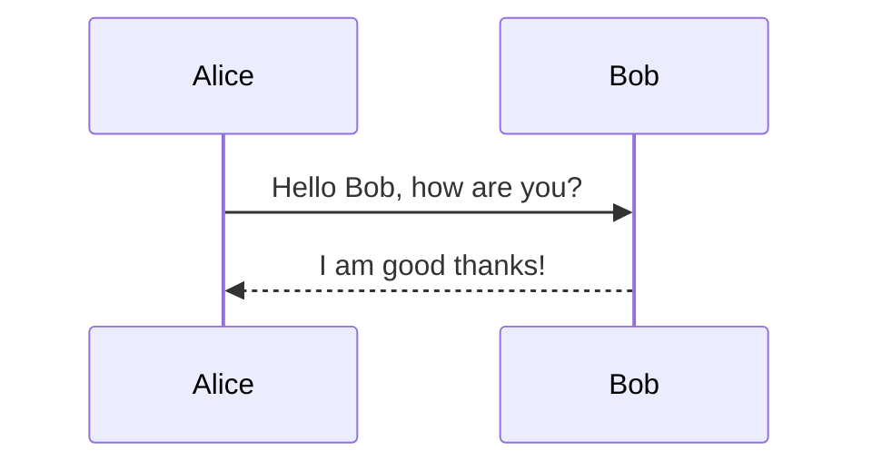
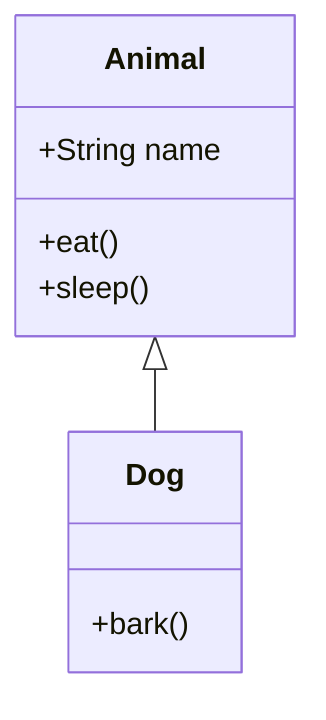
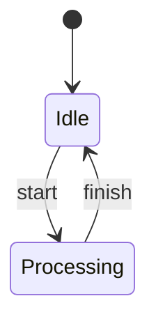
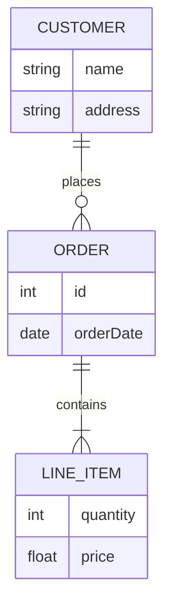
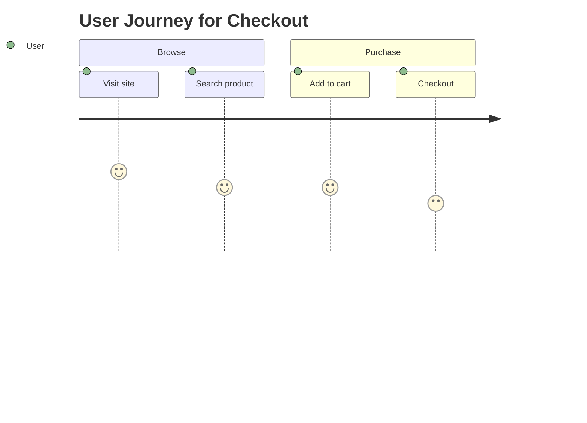
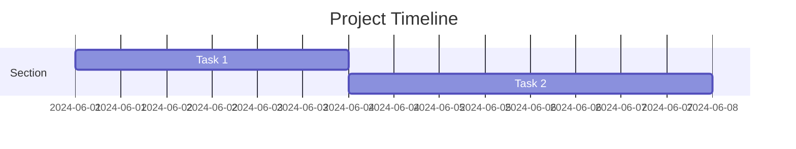
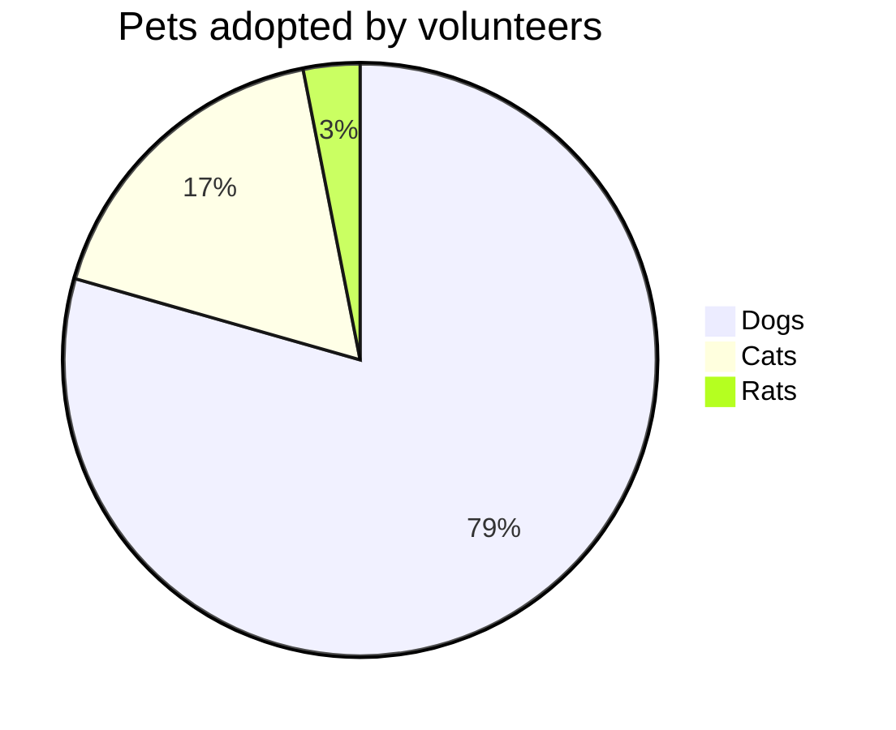
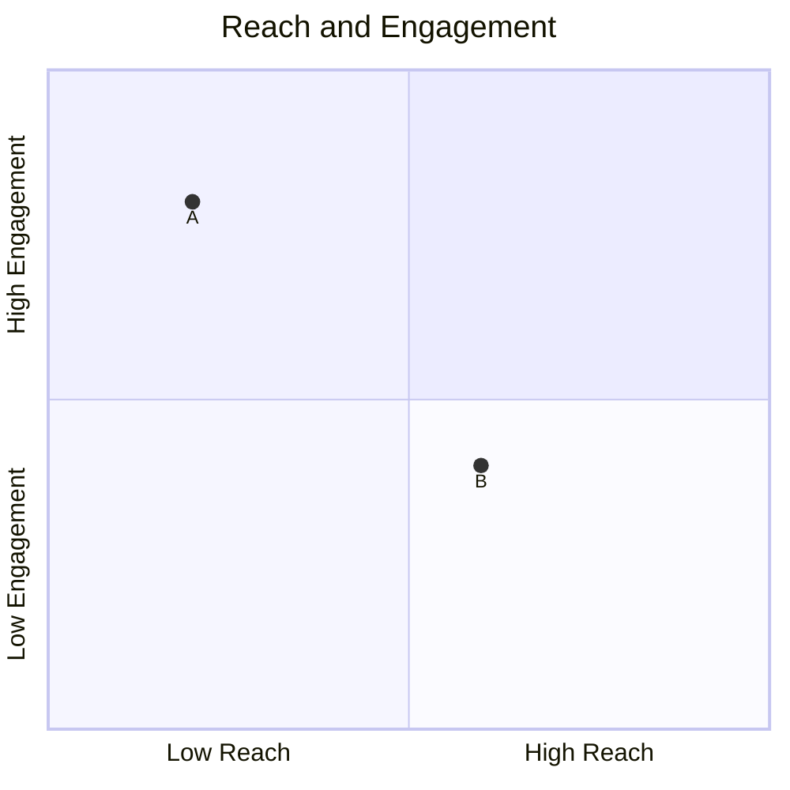

# Mermaid Diagram Examples
<!-- Mermaid documentation: https://mermaid.js.org/intro/ -->

Mermaid supports a wide variety of diagram/chart types for visualizing code, workflows, and data. For full details, see the [Mermaid documentation](https://mermaid.js.org/intro/).

**Common Mermaid Diagram Types:**
- **Flowchart** – Visualize processes, logic, and workflows.
- **Sequence Diagram** – Show interactions between components or objects over time.
- **Class Diagram** – Represent classes, methods, and relationships (UML style).
- **State Diagram** – Model state machines and transitions.
- **Entity Relationship Diagram** – Describe database tables and their relationships.
- **User Journey** – Map user journeys and experiences.
- **Gantt** – Visualize project timelines and schedules.
- **Pie Chart** – Display data proportions.
- **Quadrant Chart** – Show data in four quadrants.
- **Requirement Diagram** – Visualize requirements and dependencies.
- **GitGraph (Git) Diagram** – Illustrate Git branching and commits.
- **C4 Diagram** – Model software architecture at different abstraction levels.
- **Mindmaps** – Organize ideas and concepts hierarchically.
- **Timeline** – Show events in chronological order.
- **ZenUML** – Alternative sequence diagram syntax.
- **Sankey** – Visualize flow and distribution of resources.
- **XY Chart** – Plot data points on X/Y axes.
- **Block Diagram** – Represent system components and their connections.
- **Packet Diagram** – Visualize network packet flows.
- **Kanban** – Model Kanban boards for workflow management.
- **Architecture Diagram** – Show system or infrastructure architecture.
- **Radar Chart** – Compare multivariate data.
- **Treemap** – Visualize hierarchical data as nested rectangles.

## Rendering the Code as Diagrams

**Approach 1: GitHub in Browser**
- Push your Markdown file(s) to GitHub.
- View the file in your browser; GitHub will render Mermaid diagrams automatically.

**Approach 2: VS Code Plugin**
- **VS Code Mermaid Diagram Preview:**  
  To view Mermaid diagrams rendered as images locally in VS Code:
  1. Install the [Markdown Preview Mermaid Support](https://marketplace.visualstudio.com/items?itemName=bierner.markdown-mermaid) extension, the [Mermaid Preview](https://marketplace.visualstudio.com/items?itemName=vstirbu.vscode-mermaid-preview) extension, and the [Auto-Open Markdown Preview](https://marketplace.visualstudio.com/items?itemName=hnw.vscode-auto-open-markdown-preview) extension.
  2. Open your Markdown file containing Mermaid code blocks.
  3. With "Auto-Open Markdown Preview" installed, the preview tab will open automatically when you open a Markdown file.
  4. The Mermaid code will be rendered in the viewer tab.
  5. For `.mmd` files, use the "Mermaid Preview" extension and open the preview pane.

---

## Copilot Application Commands to Generate Diagrams

Use the following commands to generate each type of diagram for your application.  
Click the copy button to quickly copy any command.

```plaintext
/generateMermaidDiagram application flowchart
```
```plaintext
/generateMermaidDiagram application sequence
```
```plaintext
/generateMermaidDiagram application class
```
```plaintext
/generateMermaidDiagram application state
```
```plaintext
/generateMermaidDiagram application erd
```
```plaintext
/generateMermaidDiagram application userjourney
```
```plaintext
/generateMermaidDiagram application gantt
```
```plaintext
/generateMermaidDiagram application pie
```
```plaintext
/generateMermaidDiagram application quadrant
```
```plaintext
/generateMermaidDiagram application requirement
```
```plaintext
/generateMermaidDiagram application gitgraph
```
```plaintext
/generateMermaidDiagram application c4
```
```plaintext
/generateMermaidDiagram application mindmap
```
```plaintext
/generateMermaidDiagram application timeline
```
```plaintext
/generateMermaidDiagram application zenuML
```
```plaintext
/generateMermaidDiagram application sankey
```
```plaintext
/generateMermaidDiagram application xy
```
```plaintext
/generateMermaidDiagram application block
```
```plaintext
/generateMermaidDiagram application packet
```
```plaintext
/generateMermaidDiagram application kanban
```
```plaintext
/generateMermaidDiagram application architecture
```
```plaintext
/generateMermaidDiagram application radar
```
```plaintext
/generateMermaidDiagram application treemap
```

**Tip:**  
Replace `application` with `library <library_name>`, `class <class_name>`, or `function <function_name>` as needed to generate diagrams for other codebase levels.

## Copilot Library Commands to Generate Diagrams

Use the following commands to generate each type of diagram for your library.  
Click the copy button to quickly copy any command.

```plaintext
/generateMermaidDiagram library <library_name> flowchart
```
```plaintext
/generateMermaidDiagram library <library_name> sequence
```
```plaintext
/generateMermaidDiagram library <library_name> class
```
```plaintext
/generateMermaidDiagram library <library_name> state
```
```plaintext
/generateMermaidDiagram library <library_name> gantt
```
```plaintext
/generateMermaidDiagram library <library_name> requirement
```
```plaintext
/generateMermaidDiagram library <library_name> gitgraph
```
```plaintext
/generateMermaidDiagram library <library_name> c4
```
```plaintext
/generateMermaidDiagram library <library_name> mindmap
```
```plaintext
/generateMermaidDiagram library <library_name> timeline
```
```plaintext
/generateMermaidDiagram library <library_name> zenuML
```
```plaintext
/generateMermaidDiagram library <library_name> sankey
```
```plaintext
/generateMermaidDiagram library <library_name> block
```
```plaintext
/generateMermaidDiagram library <library_name> packet
```
```plaintext
/generateMermaidDiagram library <library_name> kanban
```
```plaintext
/generateMermaidDiagram library <library_name> architecture
```
```plaintext
/generateMermaidDiagram library <library_name> radar
```
```plaintext
/generateMermaidDiagram library <library_name> treemap
```

**Tip:**  
Replace `<library_name>` with the name of your library to generate diagrams for that specific library.

## Copilot Class Commands to Generate Diagrams

Use the following commands to generate each type of diagram for your class.  
Click the copy button to quickly copy any command.

```plaintext
/generateMermaidDiagram class <class_name> flowchart
```
```plaintext
/generateMermaidDiagram class <class_name> sequence
```
```plaintext
/generateMermaidDiagram class <class_name> class
```
```plaintext
/generateMermaidDiagram class <class_name> state
```
```plaintext
/generateMermaidDiagram class <class_name> erd
```
```plaintext
/generateMermaidDiagram class <class_name> userjourney
```
```plaintext
/generateMermaidDiagram class <class_name> gantt
```
```plaintext
/generateMermaidDiagram class <class_name> pie
```
```plaintext
/generateMermaidDiagram class <class_name> quadrant
```
```plaintext
/generateMermaidDiagram class <class_name> requirement
```
```plaintext
/generateMermaidDiagram class <class_name> gitgraph
```
```plaintext
/generateMermaidDiagram class <class_name> c4
```
```plaintext
/generateMermaidDiagram class <class_name> mindmap
```
```plaintext
/generateMermaidDiagram class <class_name> timeline
```
```plaintext
/generateMermaidDiagram class <class_name> zenuML
```
```plaintext
/generateMermaidDiagram class <class_name> sankey
```
```plaintext
/generateMermaidDiagram class <class_name> xy
```
```plaintext
/generateMermaidDiagram class <class_name> block
```
```plaintext
/generateMermaidDiagram class <class_name> packet
```
```plaintext
/generateMermaidDiagram class <class_name> kanban
```
```plaintext
/generateMermaidDiagram class <class_name> architecture
```
```plaintext
/generateMermaidDiagram class <class_name> radar
```
```plaintext
/generateMermaidDiagram class <class_name> treemap
```

**Tip:**  
Replace `<class_name>` with the name of your class to generate diagrams for that specific class.

## Copilot Function Commands to Generate Diagrams

Use the following commands to generate each type of diagram for your function.  
Click the copy button to quickly copy any command.

```plaintext
/generateMermaidDiagram function <function_name> flowchart
```
```plaintext
/generateMermaidDiagram function <function_name> sequence
```
```plaintext
/generateMermaidDiagram function <function_name> class
```
```plaintext
/generateMermaidDiagram function <function_name> state
```
```plaintext
/generateMermaidDiagram function <function_name> erd
```
```plaintext
/generateMermaidDiagram function <function_name> userjourney
```
```plaintext
/generateMermaidDiagram function <function_name> gantt
```
```plaintext
/generateMermaidDiagram function <function_name> pie
```
```plaintext
/generateMermaidDiagram function <function_name> quadrant
```
```plaintext
/generateMermaidDiagram function <function_name> requirement
```
```plaintext
/generateMermaidDiagram function <function_name> gitgraph
```
```plaintext
/generateMermaidDiagram function <function_name> c4
```
```plaintext
/generateMermaidDiagram function <function_name> mindmap
```
```plaintext
/generateMermaidDiagram function <function_name> timeline
```
```plaintext
/generateMermaidDiagram function <function_name> zenuML
```
```plaintext
/generateMermaidDiagram function <function_name> sankey
```
```plaintext
/generateMermaidDiagram function <function_name> xy
```
```plaintext
/generateMermaidDiagram function <function_name> block
```
```plaintext
/generateMermaidDiagram function <function_name> packet
```
```plaintext
/generateMermaidDiagram function <function_name> kanban
```
```plaintext
/generateMermaidDiagram function <function_name> architecture
```
```plaintext
/generateMermaidDiagram function <function_name> radar
```
```plaintext
/generateMermaidDiagram function <function_name> treemap
```

**Tip:**  
Replace `<function_name>` with the name of your function to generate diagrams for that specific function.

## Sample Graphs

Below are samples for each major Mermaid diagram type. Each sample includes a title, the Mermaid code, and the rendered graph.

---

### Flowchart

**Mermaid Code:**
````plaintext

````

**Rendered Graph:**


---

### Sequence Diagram

**Mermaid Code:**
````plaintext

````

**Rendered Graph:**


---

### Class Diagram

**Mermaid Code:**
````plaintext

````

**Rendered Graph:**


---

### State Diagram

**Mermaid Code:**
````plaintext

````

**Rendered Graph:**


---

### Entity Relationship Diagram

**Mermaid Code:**
````plaintext

````

**Rendered Graph:**


---

### User Journey

**Mermaid Code:**
````plaintext

````

**Rendered Graph:**


---

### Gantt

**Mermaid Code:**
````plaintext

````

**Rendered Graph:**


---

### Pie Chart

**Mermaid Code:**
````plaintext

````

**Rendered Graph:**


---

### Quadrant Chart

**Mermaid Code:**
````plaintext

````

**Rendered Graph:**


---

### Requirement Diagram

**Mermaid Code:**
````plaintext
```mermaid
requirementDiagram
    requirement req1 {
      id: 1
      text: The system shall authenticate users
    }
    requirement req2 {
      id: 2
      text: The system shall log access
    }
    req1 - req2
```
````

**Rendered Graph:**
```mermaid
requirementDiagram
    requirement req1 {
      id: 1
      text: The system shall authenticate users
    }
    requirement req2 {
      id: 2
      text: The system shall log access
    }
    req1 - req2
```

---

### GitGraph (Git) Diagram

**Mermaid Code:**
````plaintext
```mermaid
gitGraph
    commit
    branch develop
    checkout develop
    commit
    checkout main
    merge develop
```
````

**Rendered Graph:**
```mermaid
gitGraph
    commit
    branch develop
    checkout develop
    commit
    checkout main
    merge develop
```

---

### C4 Diagram

**Mermaid Code:**
````plaintext
```mermaid
C4Context
    title System Context diagram for Internet Banking System
    Person(customer, "Bank Customer")
    System(banking_system, "Internet Banking System")
    customer -> banking_system : Uses
```
````

**Rendered Graph:**
```mermaid
C4Context
    title System Context diagram for Internet Banking System
    Person(customer, "Bank Customer")
    System(banking_system, "Internet Banking System")
    customer -> banking_system : Uses
```

---

### Mindmap

**Mermaid Code:**
````plaintext
```mermaid
mindmap
  root
    A
      B
      C
    D
```
````

**Rendered Graph:**
```mermaid
mindmap
  root
    A
      B
      C
    D
```

---

### Timeline

**Mermaid Code:**
````plaintext
```mermaid
timeline
    title History of Computers
    1970 : Invention of DRAM
    1981 : IBM PC
    1991 : World Wide Web
```
````

**Rendered Graph:**
```mermaid
timeline
    title History of Computers
    1970 : Invention of DRAM
    1981 : IBM PC
    1991 : World Wide Web
```

---

### ZenUML

**Mermaid Code:**
````plaintext
```mermaid
zenuml
    Alice->Bob: Hello
    Bob-->Alice: Hi!
```
````

**Rendered Graph:**
```mermaid
zenuml
    Alice->Bob: Hello
    Bob-->Alice: Hi!
```

---

### Sankey

**Mermaid Code:**
````plaintext
```mermaid
sankey-beta

%% source,target,value
Electricity grid,Over generation / exports,104.453
Electricity grid,Heating and cooling - homes,113.726
Electricity grid,H2 conversion,27.14

```
````

**Rendered Graph:**
```mermaid
sankey-beta

%% source,target,value
Electricity grid,Over generation / exports,104.453
Electricity grid,Heating and cooling - homes,113.726
Electricity grid,H2 conversion,27.14

```

---

### XY Chart

**Mermaid Code:**
````plaintext
```mermaid
xychart-beta
    title "Sales Revenue"
    x-axis [jan, feb, mar, apr, may, jun, jul, aug, sep, oct, nov, dec]
    y-axis "Revenue (in $)" 4000 --> 11000
    bar [5000, 6000, 7500, 8200, 9500, 10500, 11000, 10200, 9200, 8500, 7000, 6000]
    line [5000, 6000, 7500, 8200, 9500, 10500, 11000, 10200, 9200, 8500, 7000, 6000]

```
````

**Rendered Graph:**
```mermaid
xychart-beta
    title "Sales Revenue"
    x-axis [jan, feb, mar, apr, may, jun, jul, aug, sep, oct, nov, dec]
    y-axis "Revenue (in $)" 4000 --> 11000
    bar [5000, 6000, 7500, 8200, 9500, 10500, 11000, 10200, 9200, 8500, 7000, 6000]
    line [5000, 6000, 7500, 8200, 9500, 10500, 11000, 10200, 9200, 8500, 7000, 6000]

```

---

### Block Diagram

**Mermaid Code:**
````plaintext
```mermaid
block-beta
  columns 3
  Frontend blockArrowId6<[" "]>(right) Backend
  space:2 down<[" "]>(down)
  Disk left<[" "]>(left) Database[("Database")]

  classDef front fill:#696,stroke:#333;
  classDef back fill:#969,stroke:#333;
  class Frontend front
  class Backend,Database back

```
````

**Rendered Graph:**
```mermaid
block-beta
  columns 3
  Frontend blockArrowId6<[" "]>(right) Backend
  space:2 down<[" "]>(down)
  Disk left<[" "]>(left) Database[("Database")]

  classDef front fill:#696,stroke:#333;
  classDef back fill:#969,stroke:#333;
  class Frontend front
  class Backend,Database back

```

---

### Packet Diagram

**Mermaid Code:**
````plaintext
```mermaid
packet
---
title: "TCP Packet"
---
packet
0-15: "Source Port"
16-31: "Destination Port"
32-63: "Sequence Number"
64-95: "Acknowledgment Number"
96-99: "Data Offset"
100-105: "Reserved"
106: "URG"
107: "ACK"
108: "PSH"
109: "RST"
110: "SYN"
111: "FIN"
112-127: "Window"
128-143: "Checksum"
144-159: "Urgent Pointer"
160-191: "(Options and Padding)"
192-255: "Data (variable length)"

```
````

**Rendered Graph:**
```mermaid
---
title: "TCP Packet"
---
packet
0-15: "Source Port"
16-31: "Destination Port"
32-63: "Sequence Number"
64-95: "Acknowledgment Number"
96-99: "Data Offset"
100-105: "Reserved"
106: "URG"
107: "ACK"
108: "PSH"
109: "RST"
110: "SYN"
111: "FIN"
112-127: "Window"
128-143: "Checksum"
144-159: "Urgent Pointer"
160-191: "(Options and Padding)"
192-255: "Data (variable length)"
```

---

### Kanban

**Mermaid Code:**
````plaintext
```mermaid
kanban
    title Project Board
    section To Do
      Task 1
    section Doing
      Task 2
    section Done
      Task 3
```
````

**Rendered Graph:**
```mermaid
kanban
    title Project Board
    section To Do
      Task 1
    section Doing
      Task 2
    section Done
      Task 3
```

---

### Architecture Diagram

**Mermaid Code:**
````plaintext
```mermaid
architecture-beta
    group api(cloud)[API]

    service db(database)[Database] in api
    service disk1(disk)[Storage] in api
    service disk2(disk)[Storage] in api
    service server(server)[Server] in api

    db:L -- R:server
    disk1:T -- B:server
    disk2:T -- B:db

```
````

**Rendered Graph:**
```mermaid
architecture-beta
    group api(cloud)[API]

    service db(database)[Database] in api
    service disk1(disk)[Storage] in api
    service disk2(disk)[Storage] in api
    service server(server)[Server] in api

    db:L -- R:server
    disk1:T -- B:server
    disk2:T -- B:db
```

---

### Radar Chart

**Mermaid Code:**
````plaintext
```mermaid
radar
    title Skill Comparison
    axes
      Communication
      Coding
      Testing
    data
      Alice : 8, 9, 7
      Bob   : 7, 8, 8
```
````

**Rendered Graph:**
```mermaid
radar
    title Skill Comparison
    axes
      Communication
      Coding
      Testing
    data
      Alice : 8, 9, 7
      Bob   : 7, 8, 8
```

---

### Treemap

**Mermaid Code:**
````plaintext
```mermaid
treemap-beta
"Products"
    "Electronics"
        "Phones": 50
        "Computers": 30
        "Accessories": 20
    "Clothing"
        "Men's": 40
        "Women's": 40

```
````

**Rendered Graph:**
```mermaid
treemap-beta
"Products"
    "Electronics"
        "Phones": 50
        "Computers": 30
        "Accessories": 20
    "Clothing"
        "Men's": 40
        "Women's": 40
```
---

